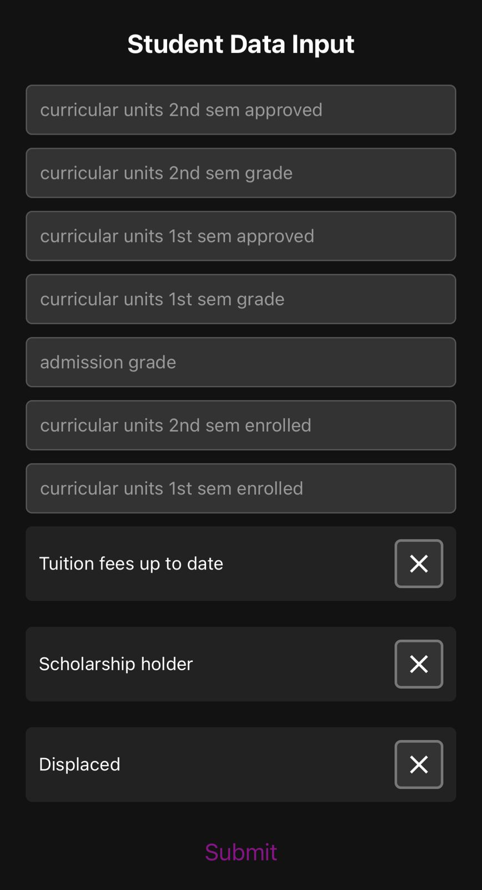

# Predicting Student Dropout and Academic Success
This repository undertakes the challenge of predicting student dropout and academic success through an extensive exploratory data analysis (EDA) of data and supervised machine learning (ML) models.
Our EDA focuses on understanding the nuances of data through univariate, bivariate, and multivariate analyses, alongside anomaly detection, to identify predictors of student outcomes.
Moreover, multiple ML models have been used and tuned to get the best performance of each. 
The project is structured in a way to easily integrate new models and datasets, through a common `BaseModel` class. The next section provides more detail on how to achieve that.
## Extending the Machine Learning Framework

This guide explains how to add a new machine learning model to the existing framework by inheriting from the `BaseModel` class. This ensures that all models maintain a consistent interface and functionality.

### Prerequisites

Before you start, make sure you are familiar with:
- Python programming
- Basic machine learning concepts
- The scikit-learn library

### Step 1: Create Your Model File

1. Create a new Python file in the `models/` directory.
2. Name the file according to your model, e.g., `your_model.py`.

### Step 2: Import Required Modules

At the top of your file, import the necessary modules. You must import the `BaseModel` class from the base model file:

```python
from .base_model import BaseModel
from sklearn.something import YourModelClassifier  # Import your specific model class from scikit-learn or another library
```

### Step 3: Define Your Model Class

Create a new class that inherits from `BaseModel`:

```python
class YourModel(BaseModel):
    def __init__(self, X_train, X_test, y_train, y_test):
        super().__init__(X_train, X_test, y_train, y_test)
```

### Step 4: Implement Required Methods

Implement the `fit` and `test_configurations` methods. The `fit` method should train the model on the training data, and `test_configurations` should find the best model configuration:

```python
def fit(self, param1=default_value):
    self.model = YourModelClassifier(param1=param1)
    self.model.fit(self.X_train, self.y_train)

def test_configurations(self):
    # Implement your logic to test different configurations and store the best result in self.results
```

### Step 5: (Optional) Override Other Methods

If needed, you can override other methods from the `BaseModel` class, such as `evaluate`, `save_model`, or `load_model`.

### Step 6: Testing Your Model

To test your new model, import and use it in the `main.py` script, similar to how other models are used:

```python
from models.your_model import YourModel

# In the appropriate section of main.py
model = YourModel(X_train, X_test, y_train, y_test)
best_config = model.run()
print(best_config)
```

### Step 7: Document Your Model

Provide documentation for your model class, methods, and any important logic to help others understand and effectively use your model.

# Running the React Native App




This section explains how to set up and run the React Native app located in the `frontends/studentmodelapp` directory. The app interfaces with the machine learning model predictions through a FastAPI server.

## Prerequisites for React Native

Before running the app, ensure you have the following installed:
- Node.js and npm (Node Package Manager)
- React Native CLI (Command Line Interface)
- Android Studio or Xcode (for Android or iOS emulation, respectively)

## Installation Steps

1. **Install Expo CLI:** Expo is an open-source platform for making universal native apps for Android, iOS, and the web with JavaScript and React.

    ```bash
    npm install -g expo-cli
    ```

2. **Navigate to the App Directory:**

    ```bash
    cd frontends/studentmodelapp
    ```

3. **Install Dependencies:**

    ```bash
    npm install
    ```

## Modify the API Server Address

To ensure the app communicates with your FastAPI server, modify the server's address in the `AppScreen.js` file. This should match the IP address of the Wi-Fi connection your server machine is connected to.

- Locate the `axios.post` line in `AppScreen.js`.
- Replace `'http://172.20.10.12:8000/predict/'` with your server's IP address and port, e.g., `'http://<Your-Server-IP>:8000/predict/'`.

## Running the App

1. **Start the React Native App:**

    ```bash
    npm start
    ```

    or, if you prefer using Expo:

    ```bash
    expo start
    ```

2. **Launch the App in an Emulator or on a Physical Device:**

    - For iOS, run `npm run ios` or `expo start --ios`.
    - For Android, run `npm run android` or `expo start --android`.

    Ensure the emulator is running, or the physical device is connected and detected by your system.

3. **Interact with the App:** Input student data and submit it to receive predictions from your machine learning model.

## Troubleshooting

- If the app cannot connect to the FastAPI server, ensure the server is running and accessible from your device.
- For issues related to npm or Expo, verify their installation or refer to their respective documentation for troubleshooting steps.

By following these steps, you should be able to run and interact with the React Native app, seamlessly integrating with the machine learning predictions from the FastAPI server.
